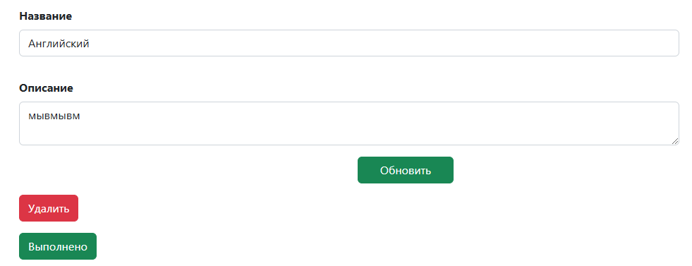

# TODO list

## Описание

TODO list — это веб-приложение для управления задачами, где пользователи могут создавать, 
редактировать и удалять задачи, а также фильтровать их по статусу выполнения.

## Функциональные возможности

Просмотр списка всех задач

Фильтрация задач:

Все задачи
Выполненные задачи
Новые задачи

Добавление новой задачи
Обновление существующей задачи
Удаление задачи

## Стек технологий

Back-end:

Java 17
Spring Boot
Hibernate
PostgreSQL

Front-end:

Thymeleaf (шаблонизатор)
Bootstrap (стилизация)

## Использование

Фильтрация задач

В приложении предусмотрены три ссылки для фильтрации задач:

Все задачи: /
Выполненные задачи: /?filter=completed
Новые задачи: /?filter=new

Добавление задачи
Для добавления новой задачи нажмите кнопку "Добавить задание" и заполните форму.

Обновление задачи
На странице списка задач нажмите на название задачи, чтобы перейти на страницу редактирования.

Удаление задачи
Нажмите кнопку "Удалить", чтобы удалить выбранную задачу.

## Установка и запуск проекта
### Требования
Java 17+

Maven 3+

PostgreSQL
### Шаги установки
1. Клонируйте репозиторий:
git clone https://github.com/I-AM-VLAD/job4j_todo.git
2. Перейдите в каталог проекта
cd job4j_todo
3. Настройте базу данных:
Создайте базу данных в PostgreSQL.
Измените настройки подключения в файле
db/liquibase.properties

changeLogFile: db/dbchangelog.xml
url: jdbc:postgresql://127.0.0.1:5432/job4j_todo
username: your_username
password: your_password
 
 Соберите и запустите приложение:
mvn spring-boot:run

 Откройте браузер и перейдите по адресу:
http://localhost:8080

## Скриншоты

### Список всех заданий

### Новые задания

### Добавить задание

### 3 кнопки

## Контакты

Если у вас есть вопросы или предложения, свяжитесь со мной:
Email: vlad1slaw19982@gmail.com
GitHub: https://github.com/I-AM-VLAD